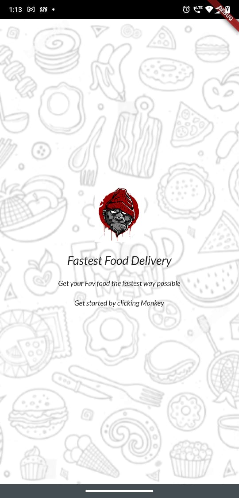
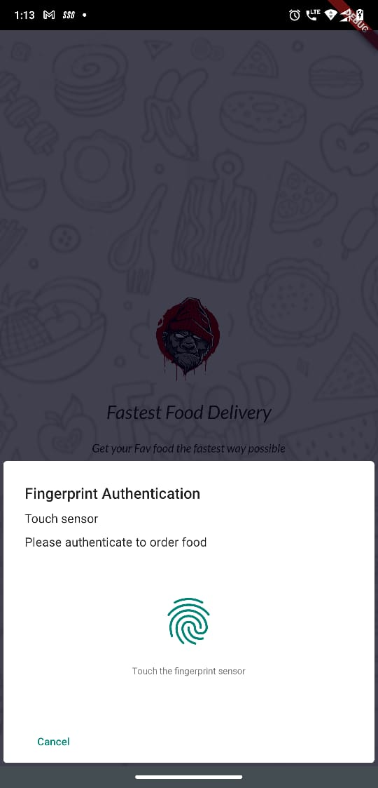
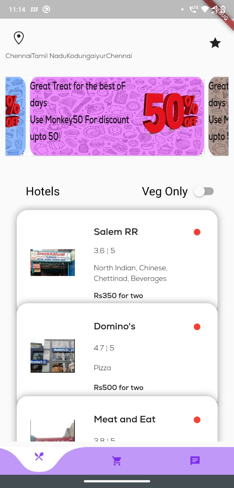
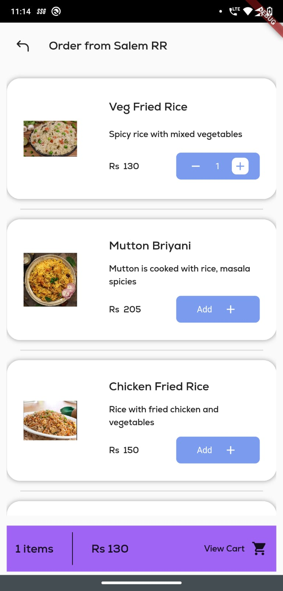
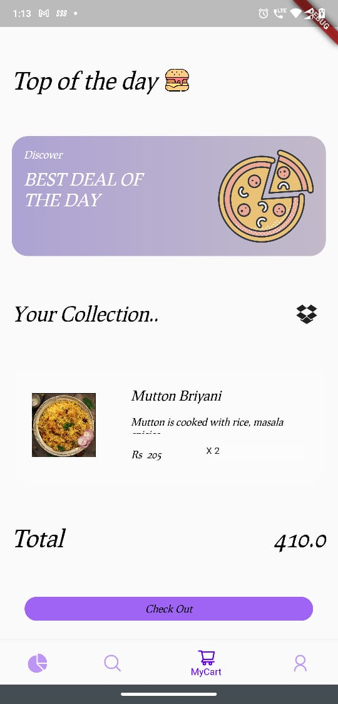
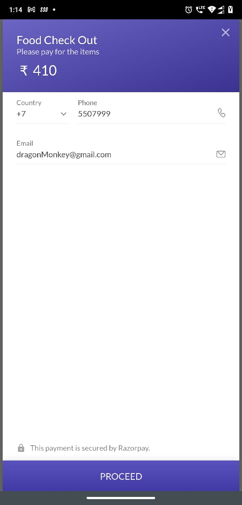
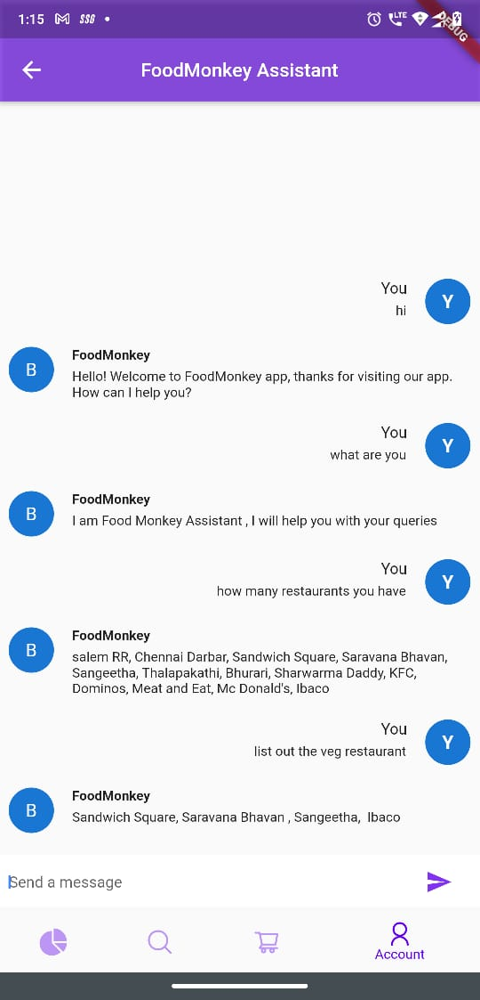
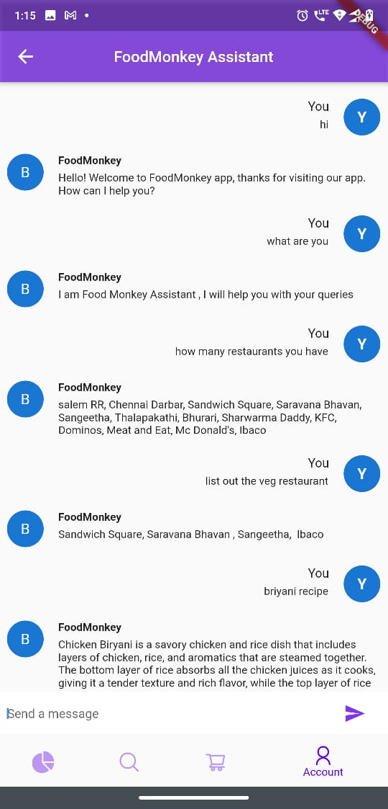

# food_delivery_app

Hi this App is used to book food from Restraunts, the front screen contains the logo, 

on clicking the logo you will have to authenicate yourself 

You will be navigated to hotel menu, you can check the offers and select the hotels you want to order
Veg only option will get you the Veg restraunts

on slecting the hotel, you will be navigating to menu card, you can select as many as dishes you want

Cart screen is used to confirm your order and quantity of the order

you will be navigate to pay the bill, dont know since it is testing project no charges is applicable 

Not yet over, you can interact with Food Monkey chat bot which will assist you with your queries regrading hotels, receipes and sooo on

